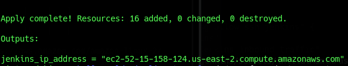
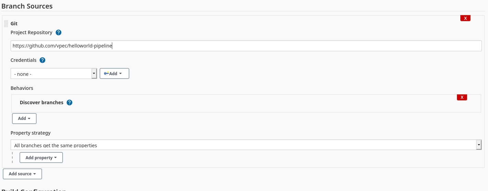
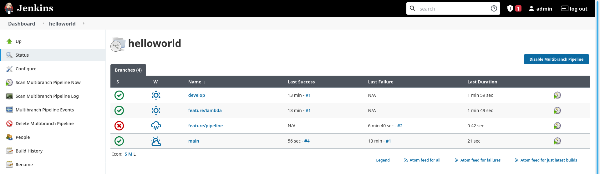
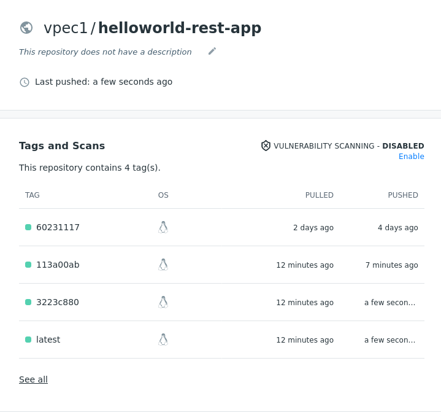
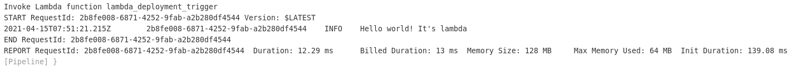
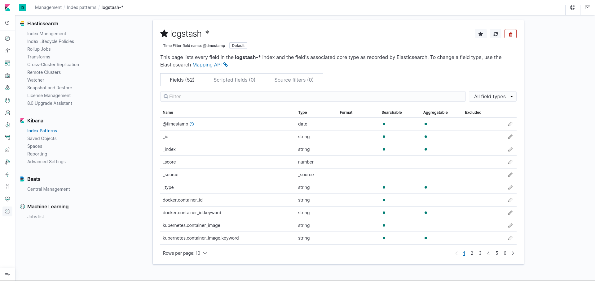
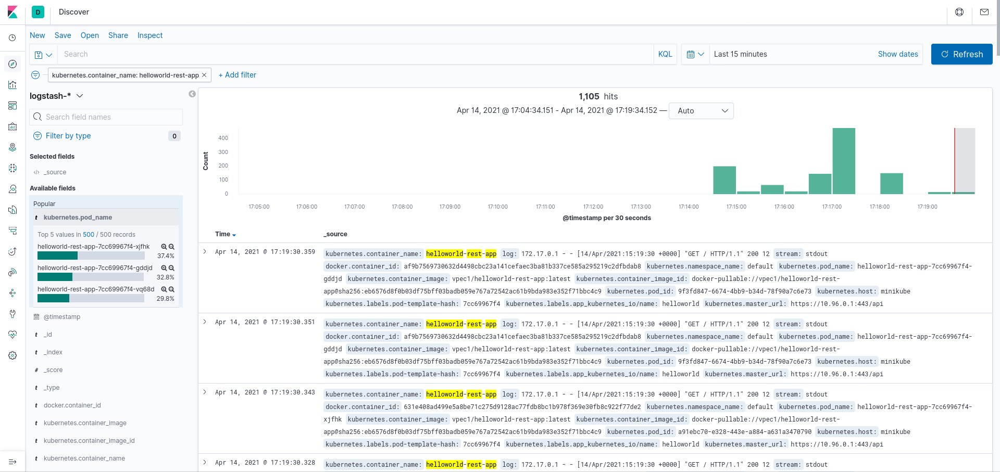

# helloworld-pipeline: Automated CI/CD pipeline ending in Kubernetes deployment

The purpose of this repository is to create a **continuous integration and continuous deployment pipeline** for a helloworld application, ending with a **Kubernetes deployment**. 

Technologies used in this project are: Spring Boot, Terraform, Jenkins, AWS EC2, AWS Lambda, Docker, Docker Compose, Kubernetes, Minikube, ElasticSearch, FluentD, Kibana.

The main elements are located in the following folders:
- helloworld-rest: spring boot application with an endpoint ("/") that returns the string "Hello World!".
- terraform: continuous integration pipeline. It contains terraform manifests for deploying the pipeline to AWS. Currently launches an EC2 instance on which a Jenkins server is automatically created. It also creates a lambda function in AWS that is used to facilitate continuous deployment.
- kubernetes: manifests to create a Kubernetes cluster on which the helloworld application is deployed.

**IMPORTANT NOTES**
1. This project has been created and tested on a Linux host machine (Debian 10). Some commands, scripts or steps may differ if you are running a different OS on your machine.
2. Currently new AWS accounts have a limited amount of cpu instances that can be active at the same time: just 1 cpu instance. Changing this limit takes some time as you need to talk to technical support in order to get it changed. The initial idea of this project was to deploy the different parts (CI/CD pipeline and Kubernetes cluster) to AWS, so the integration between them would be easier. As this has not been possible due to the limitation, some parts of the resulting system are not completely integrated. For example, instead of running the Kubernetes cluster in Amazon EKS, I have used minikube to deploy a local cluster. 
3. Although I was familiar with many of the concepts applied in this project and I had hands-on experience with some of them (SpringBoot REST APIs, containers, CI tools, monitarization...), this is my first hands-on experience using Terraform, Jenkins, AWS, Kubernetes, Minikube, ElasticSearch, FluentD and Kibana. The scripts and manifests included in this repo may not follow all the best practices as this project has been made in limited time, so please be kind :)

## HelloWorld REST application

To test the pipeline and deployment, a simple Spring Boot application has been created. After running it,  it returns "Hello World!" as a response when a request is made. Gradle has been used as build tool. Also a test folder was created. It contains a single very simple test that is executed with `gradle test`. The purpose of this test is to use it in the pipeline to symbolize the execution of automated tests in a real application.

The application.properties file specifies to print Tomcat server logs to `stdout`. The reason for this decision is explained in the [Logging and Monitoring](#logging-and-monitoring) section.

## CI/CD Jenkins Pipeline

I have used Jenkins for the creation of the pipeline. To host the Jenkins server I used an AWS EC2 (Free Tier) instance. The deployment of this instance has been done taking into account the concept of Infrastructure as Code. Terraform has been used to specify the details of the infrastructure. To perform the deployment simply run these commands from the main directory of the repo:
```
$ cd terraform
$ terraform init
$ terraform plan
$ terraform apply -auto-approve
```

Once `terraform apply` finishes, it will print the URL to access the EC2 instance


To run this commands you have to configure first `the home/user/.aws/credentials` file, as you need some credentials to deploy to AWS.

The Terraform manifests also include a script (*install_jenkins.sh.tpl*) that is injected into the EC2 instance, which is executed right after being deployed. This script installs Jenkins and Docker in the virtual machine, and creates a Jenkins service.

However, some manual steps have to be done once the instance is deployed in order to create the pipeline: 

1. Be patient. While you may SSH the virtual machine, depending on the AWS instance configuration some actions can take some time (especially if selected instances are Free Tier as in this example). Getting the Jenkins server up and running could take up to several minutes. You can check the Jenkins service status by sshing the machine and executing `sudo systemctl status jenkins`.
2. Connect to it using ssh and get Jenkins' admin password: `sudo cat /var/lib/jenkins/secrets/initialAdminPassword`.
3. Access to Jenkins (port 8080 by default) and install these plugins: GitHub, Docker, Docker API, Docker Pipeline, Pipeline: AWS Steps.
4. Set up your Docker Hub Credentials on Jenkins: Click Credentials -> global -> Add Credentials, choose Username with password as Kind, enter the Docker Hub username and password and use `dockerHubCredentials` for ID.
5. Set up your AWS Credentials on Jenkins: Click Credentials -> global -> Add Credentials, choose Username with password as Kind, enter the username (aws_access_key_id) and password (aws_secret_access_key) and use `awsCredentials` for ID.
6. **Create the pipeline**. Click New item -> Multibranch pipeline. Add GitHub source and specify your repo URL (if your repo is private you will have to provide credentials). In this case I used this repo.

Apply and save your changes.
7. If the pipeline Git scanning step doesn't work properly, you might have to change GitHub API request limit: Click Configure System -> GitHub API usage -> Select Throttle at/near rate limit.

### Pipeline structure
The pipeline created above is a Multibranch Pipeline. This type of pipeline scans all branches of the specified repository, and creates for each of them a pipeline based on a Jenkinsfile. Jenkins periodically polls the remote repository and executes the pipeline if a new commit has been made to any of the branches.



Let's take a look at the pipeline I designed for this project.

It contains 3 steps: Build, Test and Deploy. 
1. **Build**: Executes gradle build, creating a jar file that contains the Spring Boot application.
2. **Test**: Runs automated tests. In this case it only executes the simple test mentioned in the beginning of this ReadMe.
3. **Deploy**: It builds a docker image (using a Dockerfile) of the helloworld application build (jar file). It pushes the image to the DockerHub public registry. It pushes 2 images: one tagged with the commit ID, and another one tagged as 'latest'. It triggers the lambda function (this is intended to notify Kubernetes cluster so it pulls the new 'latest' image). Finally it removes the local docker images. 



This last step (Deploy) is only executed if the branch is 'main', because usually a commit to the main branch of a repository means that it is a version ready for production deployment. Other branches could be configured too. For example, a commit from 'develop' could trigger a deployment to a UAT environment.

**NOTE:** As it is mentioned in the Jenkinsfile, every pipeline workload should be executed from within an isolated node, as it is considered a best practice. In this case, as the Free Tier EC2 instance resources were so limited, I didn't follow this practice. Also, in a real environment it would be advisable to deploy the Jenkins server following a master-worker architecture, and execute these heavy pipeline workloads inside the worker nodes.
  
###### CD using AWS Lambda:

The role of the lambda function here is to trigger Kubernetes cluster update. The initial idea was to deploy the Kubernetes cluster into Amazon EKS (Elastic Kubernetes Service), but because of the limitations related to cpu instances in new AWS accounts I couldn't test it. Deploying to EKS would get greater integration between the lambda function, Jenkins server and the cluster. At this moment, this trigger is not implemented. The function contains simply a hello world handler in NodeJS.



The idea would be to connect to the cluster and execute `kubectl set image deploy helloworld-rest-app helloworld-rest-app=vpec1/helloworld-rest-app:latest`, so the new image would be forced to rollout into the cluster. After that, you can check the new image is deployed properly checking the rollout status and rollout history on your Kubernetes cluster.

After that, you could run some automated tests in the production environment to double-check the deployment went well. In the *test* folder there is a simple endpoint test (*endpoint-test.sh*) written in Bash (definitely not the best testing framework :P)

## Kubernetes deployment

So far we have created helloworld REST application and Jenkins pipeline to provide CI/CD, now it's the moment at how the application is actually deployed. As I said before, the original idea of this project was to use Amazon EKS. As it hasn't been possible, I created a local Kubernetes cluster using [minikube](https://minikube.sigs.k8s.io/docs/) to test my solution.

First of all, initialize Kubernetes cluster with minikube (in this example VirtualBox is being used as driver).
```
$ minikube start
```

Deploy ElasticSearch and Kibana servers using docker-compose. More info about this in the [Logging and Monitoring](#logging-and-monitoring) section.
```
$ sudo docker-compose -f efk/docker-compose.yaml up -d
```

Get minikube IP. This will print something like 10.0.2.2.
```
$ minikube ssh "route -n | grep ^0.0.0.0 | awk '{ print \$2 }'"
```

Replace FLUENT_ELASTICSEARCH_HOST field in kubernetes/fluentd-daemonset.yaml with previousy obtained IP.
```
env:
	- name: FLUENT_ELASTICSEARCH_HOST
	value: "10.0.2.2"  # REPLACE with host of your elasticsearch server
```

Note: The next 3 commands can be executed from the script named *init_kubernetes.sh*.

Deploy fluentd daemonset to the minikube cluster.
```
$ kubectl apply -f kubernetes/fluentd-daemonset.yaml
```

Deploy the helloworld app to the minikube active cluster. This manifest deploys 5 replicas of the helloworld app.
```
$ kubectl apply -f kubernetes/helloworld-deployment.yaml
```

Create a load balancer service to expose the deployed app.
```
$ kubectl expose deployment helloworld-rest-app --type=LoadBalancer --name=load-balancer-service
```

Now you can make a request to the helloworld app. The following command opens a browser tab and makes a request to the cluster.
```
$ minikube service load-balancer-service
```

You can make multiple requests to the endpoint using this bash script.
```
$ cd test
$ ./multi-request.sh <NUM_REQUESTS> <ENDPOINT>
```

### Logging and Monitoring

One important question is whether we are going to be able to visualize the application logs (the ones generated by the Spring Boot application) and how to do it. This helloworld application prints its logs to output stream `stdout`, following [logging best practices](https://12factor.net/logs). The docker container also prints its logs to output stream, so it prints the application logs. Finally, these container logs are gathered and presented in a centralized way, so there's no need to check the specific logs of each running pod.

To manage logging and monitoring, we are using the **EFK stack**. In the previous steps, we deployed  ElasticSearch and Kibana using docker-compose, and also FluentD was deployed as a daemonset to the cluster. These 3 elements are going to be used to collect logs, process them, and visualize them in a Kibana local server.

If you have followed the deployment steps, now enter Kibana (http://localhost:8083) and create an index pattern. (Note that it is not the default port for Kibana. The default one gave me some problems when trying to connect via browser, so it is changed to 8083 in the manifests).

When creating the index pattern, specify "logstash-*" and select @timestamp as Time Filter field name. Then select Create index pattern. The result will be something like this:


Go to the Discover tab, and you will see the logs there. If you only want to see logs coming from the application, add a new filter and select these parameters:

- Field: kubernetes.container_name

- Operator: is

- Value: helloworld-rest-app

This way you will be able to see application logs as it is shown in the image.


## Alerting

To get alerts based on different parameters of events, two things are needed: collect metrics, and create an alert based on some rule. For example, to get information about uptime of your application, you can install HeartBeat to collect these metrics, and then create a Watcher. 

To simplify HeartBeat installation, a script named *install_heartbeat.sh* is included in this repo.

In order to create a Watcher, you may need to upgrade your Kibana license (there is a 30 day trial available). Once your license is upgraded, you can now use Watcher feature. These Watchers can integrate with common communication apps (e.g. Slack) so get notified every time the application goes down.
